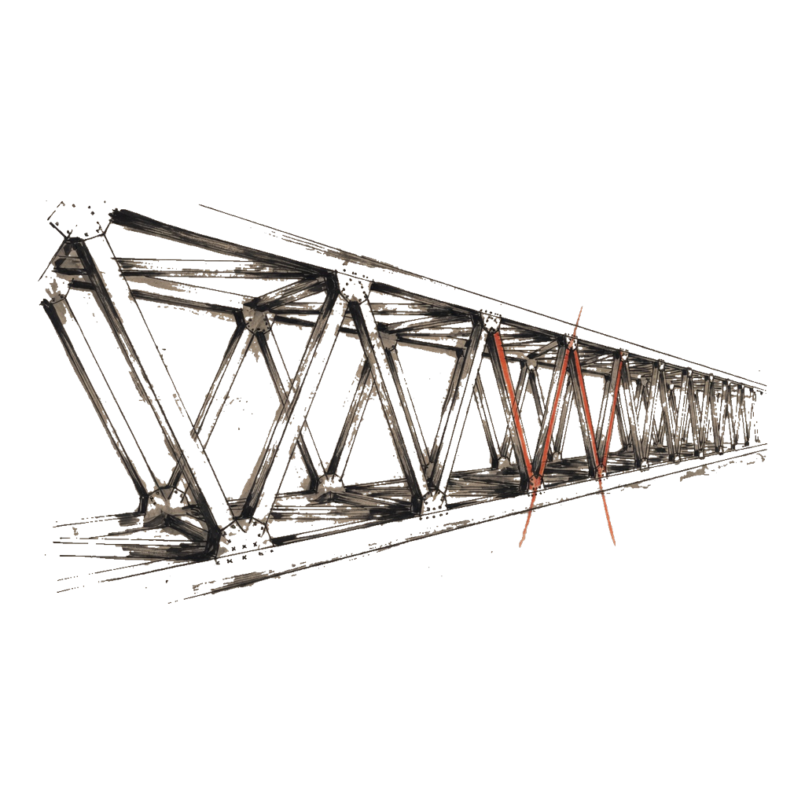
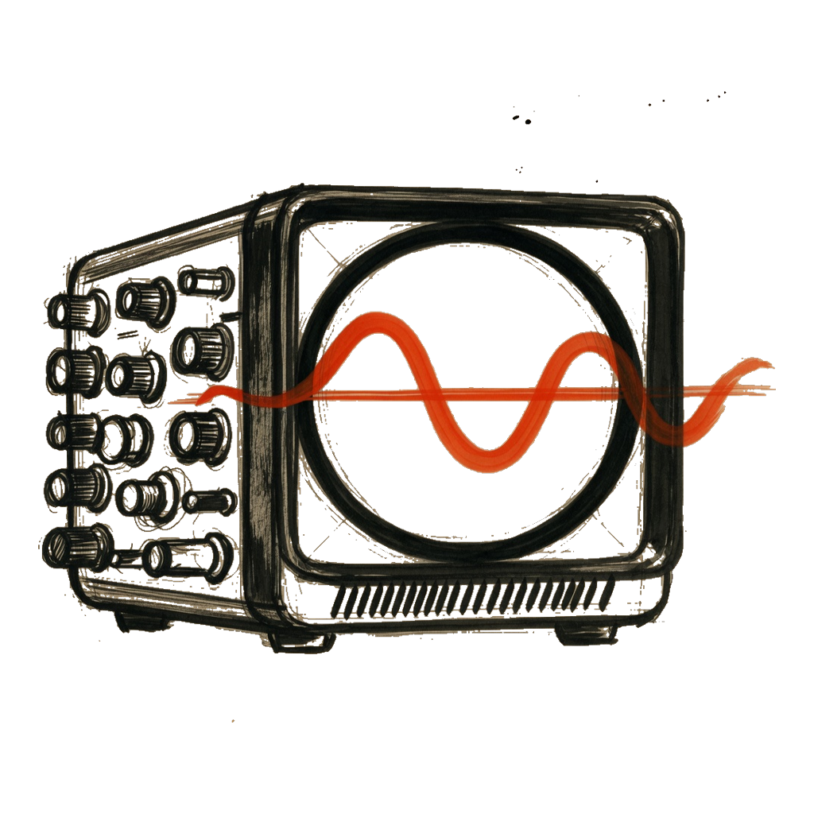

<div class="li-hero" markdown="1">

<div class="li-hero__glyph">理</div>
<p class="li-hero__tagline">理 · reason</p>

Li is a compiled language for science and simulation. You write ordinary code, then you write what has to stay true. If that doesn’t hold, Li will not give you a program.

</div>

<div class="li-lab" aria-hidden="true">
  <p class="li-lab__cap">Notebook</p>
  <figure class="li-plate"></figure>
  <figure class="li-plate"></figure>
  <figure class="li-plate"></figure>
  <figure class="li-plate"></figure>
  <figure class="li-plate"></figure>
  <figure class="li-plate"></figure>
</div>

<div class="grid cards" markdown>

-   :material-hand-wave:{ .lg .middle } **New here?**

    ---

    Start with [Hello world](guide/hello-world.md), [Math-first HPC examples](guide/math-hpc-examples.md), and the [Examples gallery](guide/examples-gallery.md).

-   :material-book-open-variant:{ .lg .middle } **Learn the language**

    ---

    [Language handbook](language/overview.md) — types, numbers, SIMD, parallel, contracts.

-   :material-cog:{ .lg .middle } **How the compiler works**

    ---

    [Build pipeline](compiler/build-pipeline.md) and [Why provable](compiler/why-provable.md).

-   :material-shield-check:{ .lg .middle } **Trust but verify**

    ---

    [All tests](testing/overview.md) and [Security audits](testing/security.md).

-   :material-robot-outline:{ .lg .middle } **Agents and chats**

    ---

    Fetch [llms.txt](https://docs.lilangverse.xyz/llms.txt), not the HTML. [How to ingest this handbook](for-agents.md).

</div>

## Three promises

| | |
|---|---|
| **Prove it** | **Target:** `lic build` fails if proofs do not close. **Today:** static gate; [gaps](verification/provability-gaps.md). |
| **Write it easily** | Readable syntax; Python-like types without `Any`. |
| **Run it fast** | LLVM + SIMD + `parallel for` after proof. |

## Quick example

```nim
def main() -> int
  requires true
  ensures result == 0
  decreases 0
=
  echo "Hello from Li"
  return 0
```

## Install and build

[Getting started — tools](guide/getting-started-tools.md)

## Full documentation map

| Section | Contents |
|---------|----------|
| [Guide](guide/hello-world.md) | Tutorials and copy-paste examples |
| [Language](language/overview.md) | Every type, feature, and rule |
| [Compiler](compiler/build-pipeline.md) | Compile-time behavior |
| [Testing](testing/overview.md) | Suites, fuzz, CI, audits |
| [Provability gaps](verification/provability-gaps.md) | What is **not** proved/wired yet (honest status) |
| [Ecosystem](ecosystem/overview.md) | Packages, `lip`, governance (`li-langverse`) |
| [Creating packages](guide/creating-packages.md) | `li-new-package` scaffold |
| [For agents](for-agents.md) | `llms.txt`, raw Markdown, handover |
| [Reference spec](superpowers/specs/2026-05-14-li-language-design.md) | Normative design (technical) |

## Project status

The compiler is under active development. Phase tracker: [Master plan](superpowers/plans/2026-05-14-li-master-plan.md). **What proofs exist today:** [Provability gaps](verification/provability-gaps.md). Native HPC (SIMD + OpenMP): [Phase 7 plan](superpowers/plans/2026-05-14-phase-07-native-hpc.md).
